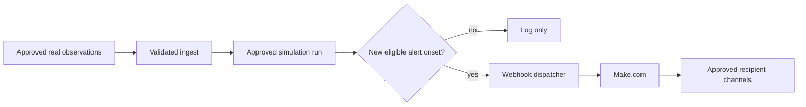

# Alerting and Automation

## Rule

Do not enable external notifications from synthetic/interpolated scenario runs.

## Pilot decision

Alerts remain dashboard-only. No Make.com stakeholder messages in first pilot. “Early warning signal” wording is allowed only after real-data validation and explicit governance approval; current synthetic runs remain “dengue risk scenarios.”

The Make.com dispatcher is implemented but disabled by default. It selects only new `HIGH` or `CRITICAL` risk onsets, signs each payload, and suppresses duplicate event IDs across model reruns.

## Future alert workflow



## Trigger conditions to define

- Which current alert types are eligible?
- Is human approval required before sending?
- Is trigger based on onset only, persistent alert, or both?
- What risk threshold and confidence threshold apply?
- How are repeat messages suppressed?

## Minimum payload

- event ID and deduplication key
- run ID and source data status
- scenario date and generated timestamp
- PSGC, barangay, municipality
- alert reason, probability, projected cases, interval
- approved observed cases for the affected barangay and reporting period
- observed-case period, data-version ID, and last-approved timestamp
- municipality/province total only when message labels its geographic scope explicitly
- weather context: forecast range, rainfall/wet-day trigger, and generated timestamp
- limitation statement
- dashboard URL, if authenticated

Observed counts, projected cases, and weather context are separate payload fields and separate message lines. Never combine them into one unlabeled "total cases" value. Make.com receives aggregate counts only—no patient names, references, addresses, ages, case IDs, or free-text notes.

Example governed payload:

```json
{
  "event_id": "RISK_ONSET:2026-08-01:126306012:HIGH:data-v42",
  "event_type": "barangay_dengue_risk",
  "run_id": "run-20260801-001",
  "psgc": "126306012",
  "barangay": "Example Barangay",
  "municipality": "Example Municipality",
  "risk_level": "HIGH",
  "outbreak_probability": 0.82,
  "projected_cases": 14.2,
  "projected_cases_lower": 8,
  "projected_cases_upper": 21,
  "approved_observed_cases": 11,
  "observed_period_start": "2026-08-01",
  "observed_data_version": "data-v42",
  "observed_last_approved_at": "2026-08-01T08:30:00+08:00",
  "weather_forecast_start": "2026-08-01",
  "weather_forecast_end": "2026-08-16",
  "wet_days": 5,
  "limitation": "Observed reports and model forecast require health-authority review; this is not confirmation of an outbreak."
}
```

Payload values above are illustrative, not live ORACLIS results.

## Safeguards

- send only newly triggered events unless escalation rule says otherwise
- log delivery attempt, provider response, recipient group, and retry state
- read observed totals from approved aggregate table, never count raw patient rows in webhook code
- suppress or route small observed counts to authorized recipients according to approved disclosure threshold
- do not send pending, rejected, discarded, or superseded records
- tie deduplication key to observed data version so a corrected approved total can generate a reviewed update without duplicate spam
- if observed aggregate is unavailable or stale, say `Approved observed total unavailable` instead of sending zero
- show data freshness and forecast freshness independently
- prohibit hard-coded recipient addresses in source
- test against sandbox webhook first
- use signed webhook secret
- provide manual disable switch
- use neutral wording: “requires review”, not “outbreak confirmed”

## Make.com scenario setup

1. Create a Make.com custom webhook and copy its HTTPS URL into backend `.env` as `MAKE_WEBHOOK_URL`.
2. Generate a long random shared secret and set identical values in `.env` as `MAKE_WEBHOOK_SECRET` and in Make.com's signature-verification step.
3. Verify `X-ORACLIS-Signature` equals `sha256=` followed by the lowercase HMAC SHA-256 hex digest of the raw request body. Reject mismatches before any Facebook module runs.
4. Add a Facebook Pages `Create a Post` module. Map `facebook_message` to message content.
5. Test with `python integration/send_make_alerts.py --dry-run`. Dry-run prints payloads and never calls Make.com.
6. Test webhook delivery against a non-public sandbox scenario only after eligible real-data test events exist.
7. After validation and governance approval, set `MAKE_ALERTS_ENABLED=true`. Keep it `false` for synthetic or interpolated runs.

Dispatcher runs after a successful `RUN_SYSTEM.bat` model run. Successful deliveries are recorded in `data/make_alert_delivery.sqlite`; event key format is `RISK_ONSET:<DATE>:<PSGC>:<ALERT_LEVEL>`. Failed deliveries are not marked sent and remain retryable.

Facebook copy is bilingual English and Filipino. Payload also provides separate `message_en` and `message_fil` fields. Every post labels output as scenario projection and states it is neither a confirmed outbreak nor an official health advisory.

## Combined risk message template

Use only after real-data validation, disclosure approval, and recipient approval:

```text
ORACLIS HIGH RISK — {BARANGAY}, {MUNICIPALITY}

Approved observed cases ({OBSERVED_PERIOD}): {OBSERVED_CASES}
Model projection: {PROJECTED_CASES} cases ({LOWER}–{UPPER})
Outbreak probability: {PROBABILITY}%
16-day weather context: {WET_DAYS} wet days from {WEATHER_START} to {WEATHER_END}
Observed data updated: {OBSERVED_UPDATED_AT}
Forecast generated: {FORECAST_GENERATED_AT}

Requires health-authority review. Not confirmation of an outbreak or an official health advisory.
```

For public Facebook posts, apply approved small-count suppression. Authorized internal messages may include unsuppressed aggregate totals only when policy permits.

## Automation acceptance checks

- Risk barangay payload includes correct approved aggregate for same PSGC and reporting period.
- Corrected approved count creates reviewed update with new data version; unchanged rerun remains deduplicated.
- Pending/rejected/discarded/superseded cases never change notification total.
- Missing aggregate renders `unavailable`, not `0`.
- Observed count, forecast count, and weather context remain visibly distinct in English and Filipino messages.
- Public route applies small-count suppression; internal route enforces authorized recipient group.
- Webhook body, Make execution history, Facebook post, delivery database, and error logs contain no patient identifiers.
- Failed publication stores no success key and remains safely retryable.

## Approval needed

- recipient groups
- notification channels
- alert owner/on-call role
- message template
- human review policy
- incident and false-alert response process
