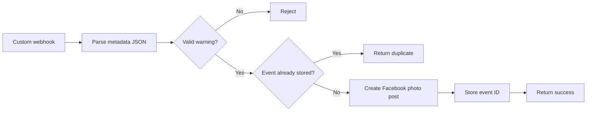
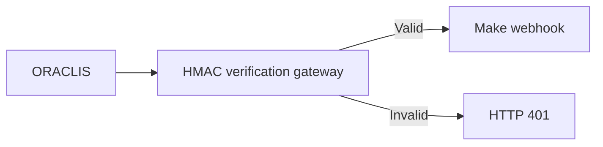

# Make.com Workflow Setup — Facebook Weather Photo Posts

This guide covers Make.com scenario setup for ORACLIS rainfall-warning photo posts. When an approved dengue-risk event exists for a barangay, caption also includes its policy-safe approved observed total and model projection. Weather-only events must say case total is unavailable rather than infer one.

> Keep `MAKE_ALERTS_ENABLED=false` until sandbox testing, Facebook Page approval, and governance review are complete.

## Workflow



## 1. Connect Facebook Page

1. Sign in to Make.com.
2. Open **Connections**.
3. Add a **Facebook Pages** connection.
4. Sign in with Facebook account that has full control of target Page.
5. Approve requested Page-management permissions.
6. Select target Page.
7. Name connection `ORACLIS Facebook Page`.

Use test Page during initial setup.

## 2. Create scenario

1. Open **Scenarios**.
2. Select **Create a new scenario**.
3. Name it `ORACLIS Weather Warning to Facebook`.
4. Set timezone to `Asia/Manila`.
5. Leave scenario inactive while configuring.

## 3. Add custom webhook

1. Add **Webhooks → Custom webhook**.
2. Create webhook named `ORACLIS Weather Photo Webhook`.
3. Copy generated HTTPS URL.
4. Put URL in backend `.env`:

```dotenv
MAKE_WEBHOOK_URL=https://hook.make.com/your-webhook-id
MAKE_WEBHOOK_SECRET=replace-with-a-long-random-secret
MAKE_ALERTS_ENABLED=false
```

Never expose webhook URL or secret in frontend code.

## 4. Capture sample request

Make needs one request to discover multipart fields.

1. Open custom webhook module.
2. Click **Run once**.
3. Keep Facebook module absent or disabled.
4. Temporarily set `MAKE_ALERTS_ENABLED=true`.
5. Restart ORACLIS API.
6. Trigger one eligible rainfall warning.
7. Wait for Make to capture request.
8. Restore `MAKE_ALERTS_ENABLED=false`.
9. Restart ORACLIS API.

Expected webhook fields:

| Field | Type | Content |
|---|---|---|
| `metadata` | JSON text | Event details and Facebook caption |
| `photo` | File | Generated PNG warning chart |
| `X-ORACLIS-Event-ID` | Header | Deduplication key |
| `X-ORACLIS-Signature` | Header | HMAC SHA-256 signature |

For combined dengue-risk posts, `metadata` additionally carries `psgc`, `barangay`, `approved_observed_cases`, `observed_period_start`, `observed_data_version`, `projected_cases`, projection interval, outbreak probability, and independent observed/forecast timestamps. These values must come from approved aggregates and a successful model run. Patient-level fields are prohibited.

Expected photo:

- Filename: `oraclis-weather-warning.png`
- MIME type: `image/png`

## 5. Parse metadata

1. Add **JSON → Parse JSON** after webhook.
2. Map webhook `metadata` into **JSON string**.
3. Create data structure named `ORACLIS Weather Metadata`.
4. Generate structure from this sample:

```json
{
  "event_id": "WEATHER_RAIN:tupi:2026-07-28:2026-08-12",
  "event_type": "weather_rainfall_context",
  "generated_at": "2026-07-28T00:00:00+00:00",
  "municipality": "Tupi",
  "forecast_start": "2026-07-28",
  "forecast_end": "2026-08-12",
  "wet_days": 4,
  "facebook_message": "English warning.\n\nFilipino warning."
}
```

## 6. Add validation filter

Add filter after JSON parser named `Valid ORACLIS weather warning`.

Require all conditions:

- `event_type` equals `weather_rainfall_context`
- `event_id` starts with `WEATHER_RAIN:`
- `municipality` exists
- `wet_days` is greater than or equal to `3`
- `facebook_message` exists
- `photo` exists
- Photo MIME type equals `image/png`

For `barangay_dengue_risk`, also require:

- valid 10-digit South Cotabato `psgc`
- `barangay` and `municipality` exist
- observed total is either an approved non-negative aggregate or explicit `unavailable`
- observed period and data version exist when total is available
- projected cases, interval, probability, and forecast timestamp come from succeeded run
- public small-count suppression was applied before webhook dispatch

Backend already validates forecast and rainfall streak. Make filter provides second boundary check.

## 7. Add duplicate protection

### Create Data Store

1. Open **Data stores**.
2. Add data store named `ORACLIS Published Weather Events`.
3. Use `event_id` as record key.
4. Add fields:

| Field | Type |
|---|---|
| `municipality` | Text |
| `forecast_start` | Text |
| `forecast_end` | Text |
| `wet_days` | Number |
| `generated_at` | Text |
| `facebook_post_id` | Text |
| `published_at` | Text |

### Check duplicate

1. Add **Data Store → Check existence of a record** after validation.
2. Select `ORACLIS Published Weather Events`.
3. Map parsed `event_id` as key.
4. Add filter allowing Facebook route only when record does not exist.

Current event ID format:

`WEATHER_RAIN:<municipality>:<forecast-start>:<forecast-end>`

## 8. Add Facebook photo post

1. Add **Facebook Pages** module.
2. Select **Create a Photo Post**, **Upload a Photo**, or equivalent photo-post action.
3. Select connection `ORACLIS Facebook Page`.
4. Select target Page.
5. Map fields:

| Facebook field | Make source |
|---|---|
| Message/caption | Parsed `facebook_message` |
| Photo/file data | Webhook `photo.data` |
| Filename | Webhook filename or `oraclis-weather-warning.png` |
| MIME type | Webhook content type or `image/png` |

Do not use text-only **Create a Post** module.

Use test Page until full flow passes.

## 9. Store successful publication

Add **Data Store → Add/replace a record** after Facebook module.

- Data store: `ORACLIS Published Weather Events`
- Key: parsed `event_id`

Map:

| Stored field | Source |
|---|---|
| `municipality` | Parsed `municipality` |
| `forecast_start` | Parsed `forecast_start` |
| `forecast_end` | Parsed `forecast_end` |
| `wet_days` | Parsed `wet_days` |
| `generated_at` | Parsed `generated_at` |
| `facebook_post_id` | Facebook module post/photo ID |
| `published_at` | Make `now` |

Store event only after Facebook succeeds. Failed posts remain retryable.

## 10. Add webhook response

Add **Webhooks → Webhook response** after Data Store write.

- Status: `200`
- Content type: `application/json`
- Body:

```json
{
  "status": "sent",
  "event_id": "{{event_id}}",
  "facebook_post_id": "{{facebook_post_id}}"
}
```

Duplicate route may return:

- Status: `409`
- Body:

```json
{
  "status": "duplicate",
  "event_id": "{{event_id}}"
}
```

Invalid route may return:

- Status: `400`
- Body:

```json
{
  "status": "rejected",
  "message": "Invalid ORACLIS weather-warning payload."
}
```

## 11. Configure error handling

Add error handler to Facebook module.

For temporary failures (`429`, `500`, `502`, `503`):

- Allow limited automatic retries.
- Do not write success record before successful post.

For permanent failures:

- Stop route.
- Preserve incomplete execution.
- Notify administrator through approved internal channel.
- Do not expose Facebook token, webhook URL, or shared secret.

Suggested failure response:

```json
{
  "status": "failed",
  "message": "Facebook publication failed."
}
```

## 12. Scenario settings

Configure:

- **Scheduling:** Immediately/as data arrives
- **Sequential processing:** Enabled
- **Store incomplete executions:** Enabled
- **Maximum consecutive errors:** `3`

Sequential processing reduces race conditions where two rapid requests both pass duplicate check.

## 13. Signature verification

Backend sends:

`X-ORACLIS-Signature: sha256=<HMAC-SHA256-of-exact-raw-body>`

Make may expose only parsed multipart fields, not exact raw multipart bytes. If raw body is unavailable, Make cannot reconstruct and verify current signature safely.

For production, place verification gateway before Make:



Gateway options:

- Cloudflare Worker
- Azure Function
- AWS Lambda
- Small HTTPS service

Gateway must read exact raw body, verify signature with constant-time comparison, and forward only valid requests.

## 14. Test checklist

### Disabled test

- `MAKE_ALERTS_ENABLED=false`
- Trigger request
- Expected: Make and Facebook receive nothing

### Webhook capture test

- Facebook module disabled
- Webhook in **Run once**
- Expected: parsed metadata plus PNG file

### Test Page post

Confirm:

- PNG attached
- English and Filipino caption present
- Municipality correct
- Date range correct
- Weather-context disclaimer present
- No confirmed-outbreak claim

### Duplicate test

Send same event twice:

- First request posts
- Second request stops before Facebook
- Only one Page post exists

### Failure test

Disconnect Facebook connection temporarily:

- Facebook module fails
- Data Store success record is not written
- Event remains retryable

## Final module order

```text
1. Webhooks — Custom webhook
2. JSON — Parse JSON
3. Filter — Valid ORACLIS weather warning
4. Data Store — Check record existence
5. Filter — Event does not exist
6. Facebook Pages — Create a Photo Post
7. Data Store — Add published event
8. Webhooks — Webhook response
```

Do not enable live publishing until test Page validation and governance approval are complete.
